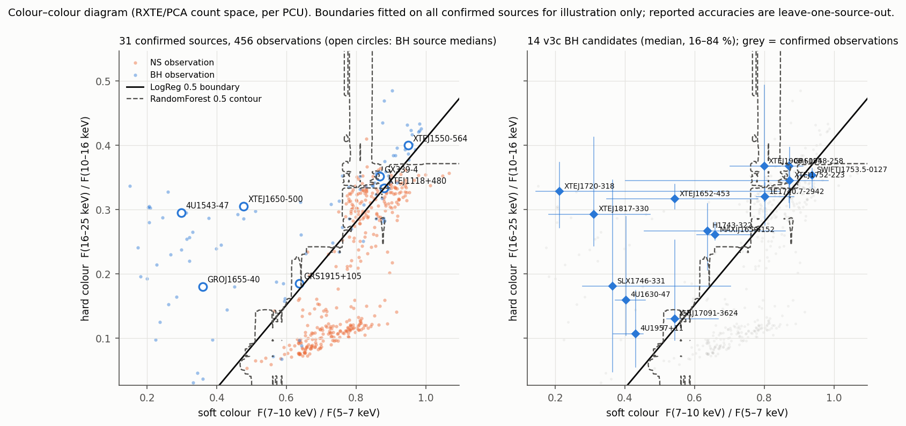

# RXTE X 射線雙星 BH／NS 能譜分類：整合報告（v1–v3）

日期：2026-09-30　｜　分版細節：[v1](report_zh-TW.md)、[v2](report_v2_zh-TW.md)、[v3](report_v3_zh-TW.md)　｜　決策紀錄：[decision_log.md](decision_log.md)

> **結論**：單次 RXTE/PCA 觀測的 5–25 keV 能譜，對「訓練時沒見過的天體」可以做出優於隨機的 BH／NS 判斷
> （31 個確認天體上，來源層級 balanced accuracy 約 0.80–0.87、AUC 約 0.88–0.95），
> 但**可分辨的資訊幾乎都在兩個硬度比裡**：完整能譜、3–5 keV 延伸、總強度都沒有帶來可測量的額外資訊。
> 硬態的 BH 與 NS 在這兩個顏色上重疊，是主要的錯誤來源。動力學確認的 BH 只有 7 個，所有 BH 端的結論都很不確定。
>
> **v4 補充（2026-10-01，見 §10）**：換演算法、加 HEXTE 25–60 keV、每源改用全部合格觀測，都沒有在原本 31 個天體上勝過兩個顏色的 LR；延伸到更早 gain epoch（46 個天體）後，RF 只在門檻上較好。
> **v5 補充（見 §11）**：加入 Standard-1 的低頻時間變異後，H+T-LR 在 v2 樣本上點估計明顯較好（來源 BA 0.908、AUC 0.988），但依嚴格規則 primary 未偵測到；描述性比較方向一致，屬探索性訊號。
> **v6 補充（見 §12）**：凍結模型在 23 個沒見過的確認天體上，加入時間特徵使來源 BA 從 0.868 升到 0.974、Brier 與 log loss 改善，但 AUC 已飽和、primary 依嚴格規則未偵測到；BH 低頻變異較強的機制在外部天體上沒有複製。
> **v7 補充（見 §13）**：「軟態分得開、硬態分不開」有了信賴區間：v2 H-LR 的觀測層級 AUC 軟態類 0.954、硬態類 0.646，差 +0.31 [+0.10, +0.51]；以 MINBAR 排除 type-I 爆發後結論不變；加入三個持續黑洞未改變原 31 源的表現。在 MAXI 上以動力學確認 BH 重做 de Beurs 的分類，LR 幾乎沒有分辨力，預先宣告的比較未偵測到差異。
> **v8 補充（見 §14）**：在 v2 樣本的硬態類觀測中，加入低頻時間變異後 AUC 0.646 → 0.910（差 +0.264 [+0.048, +0.455]，有差異），能態差距大幅縮小；但在外部天體的硬態類上未確認（+0.064 [−0.185, +0.367]）。RXTE event mode 的高頻（4–1024 Hz）在低頻之外幾乎沒有增量（探索性）。MAXI 上 2–4 keV 的增益在 HI4PI N_H 校正後仍在（+0.377 [+0.160, +0.595]）。
> **v9 補充（見 §15）**：換成 NICER（獨立儀器、新年代、2 個從未用過的 BH），只用顏色時硬態類 AUC 0.68（與 RXTE 的 0.65 相近），加入時間特徵後 0.80（+0.112 [−0.004, +0.229]），同顏色下 BH 的特徵頻率約低 2 倍（p = 0.136）；方向與大小都與 RXTE 一致，但兩項預先宣告的檢定都差一點點、依規則未偵測到。
> **v10 補充（見 §16）**：把 RXTE 與 NICER 的所有天體合在一起（86 個、16 個 BH），硬態內的時間增益 +0.145 [+0.028, +0.257]、同顏色下 BH 的特徵頻率低 0.37 dex（p = 0.0012），兩項預先宣告的合併檢定都有差異，且不靠任何單一 BH；但假說來自 v5–v9，屬整體證據而非獨立確認。
> **v11 補充（見 §17）**：在從未用過的 NICER 觀測上做凍結的前瞻性檢驗：LR 的硬態時間增益未確認（+0.066 [−0.095, +0.180]），RF 增益 +0.25 與先前一致；BH 特徵頻率較低依規則有差異（−0.66 dex，p = 0.023），但對可能背景主導的極硬觀測敏感（剔除後 p = 0.19）。
> **v12 補充（見 §18）**：以 3C50 修正 NICER 背景後，RF 的硬態時間增益仍在（+0.174 [+0.071, +0.300]），BH 特徵頻率較低的效應大小不變（−0.51 dex）但 p = 0.073；背景不是造成效應的原因。
> 以下 §1–§9 的 v1–v3 數字沒有改動。

---

## 1. 研究問題

一次觀測的 X 射線能譜，能否辨識 X 射線雙星中的緻密星是黑洞（BH）還是中子星（NS）？
最重要的測試是：**模型能否分類訓練時沒有見過的天體**。

同一天體的多次觀測彼此高度相關。如果訓練集和測試集裡有同一個天體，模型只要「認得這個天體」就能答對，
正確率會被高估。所以本研究所有主要結果都用 **leave-one-source-out（LOSO）**：每次整個保留一個天體測試，其他天體訓練。

## 2. 資料與處理

| 項目 | 內容 |
|---|---|
| 資料 | HEASARC 官方 RXTE Standard Products：Standard-2 source spectrum、pcabackest 背景譜、response。文獻作者沒有公開處理後的能譜，所以無法直接重用 Pattnaik+2021／Garg+2026 的資料 |
| 儀器時期 | PCA gain epoch 5（2000-05-13 起），避免跨增益時期的通道與能量對應問題 |
| 特徵 | 背景扣除、deadtime 修正後的淨計數率，重分箱到共同能量格點（45 bins，4.91–25.0 keV），單位 count/s/keV/PCU。這是**儀器計數空間**，不是物理通量 |
| 背景扣除 | 依官方規則以 EXPOSURE 與 BACKSCAL 縮放後相減；非正值照實保留，不取絕對值也不刪除 |
| 驗證 | 在 12 筆觀測上與 XSPEC 交叉比對，淨計數率與誤差一致到約 10⁻¹⁰ |
| 天體（v2、v3 主樣本） | BH：BlackCAT 中有動力學質量證據、且有 ≥10 筆合格觀測者，共 7 個。NS：Galloway+2008 中有 type-I burst、且有 RXTE 目錄者，共 24 個 |
| 觀測 | 每個天體依時間分層、固定亂數抽 15 筆，共 456 筆（105 BH、351 NS），1842 ks |
| 候選（v3c） | 14 個 BlackCAT BH candidate、210 筆觀測；只用於預測和敏感度分析，**不進入主評估** |

來源規則、抽樣、品質篩選和特徵定義都在看模型結果之前寫進預先設定文件（`preregistration*.md`）。
每次事後變更都記在 `decision_log.md`，並註明是否發生在看過結果之後。

## 3. 評估方法

- 模型：DummyClassifier（基準）、Logistic Regression（含標準化的 Pipeline）、Random Forest（500 棵樹）。
  超參數固定、不調參；兩個類別都用 `class_weight=balanced`。
- 能譜表示：A（保留強度，asinh 轉換）、B（逐譜除以總計數率的形狀）、H（兩個顏色 F(7–10)/F(5–7)、F(16–25)/F(10–16)）、
  HI（H 加上 log 總計數率），以及 v3 的巢狀與延伸版本。
- 來源層級判斷：把該天體所有觀測的 out-of-fold BH 分數平均，≥0.5 判為 BH。門檻事先固定，沒有在測試結果上調整。
- 不確定性：在 BH、NS 內各自有放回地重抽天體 2000 次（bootstrap），不重新訓練模型。

## 4. 結果

### 4.1 洩漏有多嚴重
同樣的模型和資料，改用逐觀測 5-fold 切分（同一天體同時出現在訓練與測試）：
balanced accuracy **0.77–0.88**；改用 LOSO：**0.61–0.78**。
在相同的表示與模型下，逐觀測切分高估約 0.04–0.16（A-RF 最多）。Garg+2026 報告的 90–94% 用的是逐觀測隨機切分，
所以不能拿來回答「新天體」的問題。

### 4.2 主要結果（v2 樣本，LOSO，31 個天體）

| 表示 | 模型 | 觀測 balanced acc. | 來源 balanced acc. | 來源 AUC（95% 區間） |
|---|---|---|---|---|
| H 兩個顏色 | LR | 0.78 | 0.80 | 0.92（0.80–0.99） |
| H 兩個顏色 | RF | 0.76 | 0.86 | 0.91（0.75–1.00） |
| B 完整形狀 | LR | 0.76 | 0.77 | 0.88（0.69–1.00） |
| B 完整形狀 | RF | 0.76 | 0.86 | 0.89（0.73–1.00） |
| A 保留強度 | LR | 0.72 | 0.87 | 0.95（0.83–1.00） |
| A 保留強度 | RF | 0.61 | 0.62 | 0.88（0.74–0.99） |

Dummy 基準的 balanced accuracy 是 0.50。天體比例是 7:24，所以「分對幾個天體」會誤導
（全部判 NS 就有 24/31），標題指標一律用 balanced accuracy 與 AUC。

### 4.3 資訊都在硬度裡

| 事先宣告的比較 | 結果（bootstrap 95% 區間） |
|---|---|
| 形狀 B vs. 兩個顏色 H（v2） | 無可測量差異 |
| H＋完整形狀 vs. H（v3a） | 來源 balanced acc. −0.02／0.00；AUC −0.05／−0.01（LR／RF），區間都包含 0 或在 0 以下 |
| 延伸到 3 keV vs. 5–25 keV（v3b） | 沒有任何區間完全大於 0；加一個軟色反而讓 LR 觀測層級略差（−0.03） |
| H＋45 個強度 bin vs. HI（v3a） | LR 觀測層級變差（−0.055，區間不含 0） |

H 和 B 的逐筆分數高度一致（Spearman ρ = 0.91／0.83，預測標籤一致 88%／93%），
表示兩個模型不只正確率相近，連判斷每一筆觀測的方式都幾乎相同。

### 4.4 分類器長什麼樣子

`figures/final/colour_colour_decision_boundary.png`（由 `scripts/15_colour_colour.py` 產生）。
左圖是 456 筆確認觀測；實線是 LR 用全部資料擬合的 0.5 邊界，虛線是 RF 的 0.5 等高線。
**這些邊界只是為了視覺化**，報告中的正確率都來自 LOSO，而不是這次的全資料擬合。

從圖上可以直接看到：
- NS 觀測形成一條從左下往右上的軌跡。
- 4U 1543-47、XTE J1650-500、GRO J1655-40 的觀測多數落在左上方（軟色低、硬色相對高），與 NS 分得很開。
- GX 339-4、XTE J1118+480、XTE J1550-564 的中位數落在 NS 軌跡右上端的密集區；GRS 1915+105 靠近邊界。
  這些天體（或它們的大部分觀測）就是主要被分錯的地方。
- 右圖：14 個候選中，大部分的中位數落在邊界 BH 一側；Swift J1753.5-0127、GRS 1758-258、1E 1740.7-2942 等
  落在 NS 軌跡右上端附近，與硬態確認 BH 的位置相近。

### 4.5 其他發現
- **RF 在強度表示 A 下的失敗是門檻問題**：它對天體的排序（AUC 0.88）和形狀表示差不多，只是 BH 分數整體被壓到 0.5 以下。
  把候選加入訓練、讓 BH 觀測數從 105 增為 315 後，A-RF 的來源 balanced accuracy 從 0.62 升到 0.87；
  其他平衡良好的設定幾乎沒有變化。
- **候選的預測**（沒有驗證標籤，不是正確率）：以 H 為例，12/14（LR）或 10/14（RF）個候選的平均分數 ≥0.5。

## 5. 解讀

**數據直接支持**
1. 在 RXTE/PCA 5–25 keV 計數空間中，對沒見過的天體，BH／NS 的判斷優於隨機，但資訊基本上可以用兩個硬度比概括。
2. 硬態 BH 與 NS 在這兩個顏色上重疊；軟態（盤主導）的 BH 則分得很開。
3. 逐觀測隨機切分會高估新天體上的表現（本樣本中 +0.04 ~ +0.16）。

**可能解釋（未驗證）**
- 軟態 BH 的能譜是較冷的盤加上延伸到高能的冪律尾巴，所以軟色低、硬色偏高；NS 的熱成分多半在 10–20 keV 就截止，
  高能端下降較快。這在 colour–colour 圖上會表現為不同區域。文獻中 Done & Gierliński（2003, MNRAS）
  用 RXTE 顏色比較過 BH 與 NS 的能譜差異，方向上一致，但他們的顏色經過 response 校正、定義也不同，本研究沒有做正式比較。
- 硬態時兩者都是 Comptonization 主導，5–25 keV 的形狀很相近，可能需要更寬能段（例如 >25 keV 的截止能量）
  或時間變化特徵才能分開。
- 3–5 keV 沒有幫助，可能是因為那裡的差異被星際吸收 N_H 主導，而 N_H 與 BH／NS 身分無關。

**需要更多資料驗證的假說**
- 更多確認 BH 是否能讓完整能譜勝過兩個顏色。
- 在相同硬度或相同能態下，BH 與 NS 是否仍可分辨。
- 結論能否推廣到其他儀器（例如 response 校正後的物理空間，或 NICER、NuSTAR）。

## 6. 與文獻比較

| | Pattnaik+2021 | Garg+2026 | 本研究 |
|---|---|---|---|
| 天體 | 61（含 candidates 標為 BH） | 61（修正一個 ObsID 配對） | 31 確認＋14 candidates（分開處理） |
| 評估 | LOSO，sigma-clipped 平均來源正確率 87±13% | 逐觀測隨機 80:20，500 次 | LOSO，不剪裁；balanced accuracy＋AUC＋bootstrap |
| 特徵 | 43 通道計數率（XSPEC 輸出） | 同 Pattnaik＋誤差；擬合參數 | Python 從 StdProd 處理，XSPEC 驗證 |
| 主要結果 | 87% | 90–94% | 來源 balanced acc. 0.80–0.87；資訊 ≈ 兩個顏色 |

本研究的 LOSO 結果與 Pattnaik 的數量級相近。新增的發現是：這個表現幾乎可以完全用兩個硬度比重現。
由於特徵類似，Pattnaik 的 Random Forest 很可能主要也是學到硬度，但本研究沒有直接檢驗他們的模型。

## 7. 限制

1. 只有 7 個動力學確認 BH；「未偵測到增量資訊」不等於「證明沒有」。
2. 特徵在儀器計數空間、未做 response unfolding，結論只適用於 RXTE/PCA。
3. bootstrap 只重抽天體、不重新訓練，區間不含模型擬合的變異；不同類型的 NS（Z source、atoll、AMXP）與 GRS 1915+105
   這類特殊天體，可能讓「天體可交換」的假設不成立。
4. 使用官方 Standard Products（通用篩選條件、不同產生日期的背景模型版本），官方說明這些產品不是可直接發表的最終處理。
5. 能態沒有逐筆的文獻標籤；本研究沒有自行判定硬態／軟態，「硬態 BH 被分錯」是從位置與已知行為推測的描述。
6. BH 候選的身分未確定；5 個銀河中心候選中有 3 個進入樣本，可能有視野內其他亮源混入。

## 8. 重跑方式

所有程式都在 `scripts/`，依序執行的指令見 `README.md`（Windows：`run_all.ps1`、`run_v3.ps1`；macOS／Linux：`run_all.sh`、`run_v3.sh`）。
收尾圖：`python scripts/15_colour_colour.py`（只需要 repo 內的 `data/v2/processed` 與 `data/v3c/processed`）。
環境版本鎖定在 `requirements-lock.txt`；原始 FITS 不在 git，下載程式會依 `data/*/observations.csv` 重新取得。
v1、v2、v3 的所有結果都保留、沒有被覆蓋，逐筆 out-of-fold 預測與固定的 fold 都在 `results/`。
v4：`run_v4.ps1`／`run_v4.sh`（見 §10 與 `README.md`），輸出在 `results/v4*/`、`figures/v4*/`。

## 9. 若要繼續

本 pilot 的問題已有清楚答案，建議先停止擴充。若要繼續，每一項都需要新的預先設定：
依能態分組比較（需要事先定義能態規則或文獻標籤）、時間變化特徵（需要 event mode 資料）、
或以 XSPEC 在物理空間建立特徵，檢驗結論是否與儀器無關。

## 10. v4：換演算法、加資料、加能段（2026-10-01 新增）

細節：[report_v4_zh-TW.md](report_v4_zh-TW.md)　｜　預先設定：[preregistration_v4.md](preregistration_v4.md)（**寫於看過 v1–v3 全部結果之後**）

**做了什麼**：以 v2 的 H-LR（來源 balanced accuracy 0.795 [0.589, 0.958]、來源 AUC 0.923 [0.804, 0.994]）為基準，
全部以 LOSO、2000 次分類別天體 bootstrap 做配對比較；配對差區間完全 > 0 才稱「有提升」，否則寫「未偵測到」。

| 部分 | 主要結果（與 H-LR 的配對差） | 判讀 |
|---|---|---|
| v4a 換演算法（primary：巢狀自動選擇 8 演算法 × 4 表示） | 來源 BA −0.062 [−0.146, +0.021]；來源 AUC −0.173 [−0.399, +0.012] | 未偵測到 |
| v4a 76 個描述性組合 | 3 個 QDA 組合來源 BA 區間 > 0；來源 AUC 區間 > 0 的 0 個 | 多重比較下不作結論 |
| burst 汙染檢查 | 排除含 type-I burst 的觀測後，H-LR 與 v1–v3 結論不變 | 不影響 |
| v4b3 HEXTE 25–60 keV | 來源 BA ±0.000；來源 AUC −0.048（LR）／0.000（RF） | 未偵測到 |
| v4b2 更早 gain epoch（46 天體：9 BH、37 NS） | 同樣本比較：RF 來源 BA +0.068 [+0.014, +0.122]、來源 AUC −0.01；在原 31 天體上無提升 | 來源 BA 有提升（門檻），AUC 未偵測到 |
| v4b1 每源全部合格觀測 | 天體等權重 H-LR（7,949 筆）：來源 BA 0.000 [0, 0]、來源 AUC 0.000 [−0.048, +0.036]；31 個天體判斷與 v2 完全相同 | 未偵測到 |

**解讀**
- 數據直接支持：在原本 31 個天體上，沒有任何主要比較勝過兩個顏色的 LR；在訓練天體內自動挑模型反而變差（內層 AUC 0.96–1.00、外層 0.75），
  顯示 31 個天體的樣本上挑選模型本身就有很大的樂觀偏差。擴充到 46 個天體後，RF 的優勢只在門檻（NS 判對 37/37 vs 32/37），不在排序。
- 可能解釋（未驗證）：兩個顏色已經壓縮了 5–25 keV 可分辨的資訊；更有彈性的模型可能只是學到天體身分（例如強度），換到新天體時失效。
- 需要更多資料的假說：更多動力學確認的 BH、依能態分組、疊加 HEXTE 或 NuSTAR 高能能譜，是否能分開硬態 BH 與 NS。

**限制**：v4 預先設定寫於看過結果之後；BH 仍只有 7（擴充 9）個；v4b2 發現 v2 的來源規則執行時漏掉 13 個有目錄檔的 NS——
v1–v3 的數字保留不改，但它們代表的是較小的 NS 樣本（見 [decision_log.md](decision_log.md)）。

## 11. v5：Standard-1 低頻時間變異（2026-10-01 新增）

細節：[report_v5_zh-TW.md](report_v5_zh-TW.md)　｜　預先設定：[preregistration_v5.md](preregistration_v5.md)（**寫於看過 v1–v4 之後，依使用者指示自行核准**）

**做了什麼**：以兩組獨立 PCU 的 cospectrum（Poisson 雜訊期望值為 0）計算 0.016–0.094、0.10–1.0、1.0–4.0 Hz 的分數 rms（T1–T3），
加到兩個顏色上（H+T），與 v2 H-LR 做相同的 LOSO 與配對天體 bootstrap。實作檢查全部通過（與傳統方法 ρ = 0.97；BH 天體內 rms 與硬度正相關）。

| 比較 | 來源 BA 差 | 來源 AUC 差 | 判讀 |
|---|---|---|---|
| S1 primary：H+T-LR − H-LR（456 筆） | +0.113 [−0.021, +0.277] | +0.065 [0.000, +0.179] | 未偵測到（觀測 BA +0.102 [+0.001, +0.249]） |
| S1 顏色重疊區 | +0.118 [−0.113, +0.349] | +0.185 [+0.008, +0.403] | 描述性 |
| S2 46 個天體 vs 同樣本 H-LR | +0.123 [+0.027, +0.261] | +0.042 [0.000, +0.108] | 描述性 |
| S3 7,949 筆 vs v2 H-LR | +0.205 [+0.042, +0.411] | +0.077 [+0.006, +0.196] | 描述性（31 個天體全部判對） |

**解讀**：這是 v1–v5 中第一個「在兩個顏色之外」出現的資訊訊號：在顏色重疊的硬態區，BH 在 0.016–0.1 Hz 的變異明顯較強，
XTE J1118+480 與三個硬態 NS 因此被改對。但 primary 依事先寫定的規則是「未偵測到」，描述性比較共用天體、不是獨立確認；
下一步應在訓練時沒用過的天體上，以事先固定（凍結）的模型檢驗。

## 12. v6：外部驗證與新方法（2026-10-01 新增）

細節：[report_v6_zh-TW.md](report_v6_zh-TW.md)　｜　預先設定：[preregistration_v6.md](preregistration_v6.md)（**寫於看過 v1–v5 之後，依使用者要求「新方法」自行設計並核准**）

**做了什麼**：只在 31 個 v2 天體上訓練、之後凍結的模型（H_R-LR 與 H_R+T-LR），分類 23 個訓練時從沒用過的確認天體
（HMXB 動力學 BH：Cyg X-1、LMC X-3；以脈衝確認的 AMXP 6 個；v4b2 的 15 個天體）。另外測試新方法：全配對 cospectrum 估計量、νPν 質心頻率、
顏色條件時間概似比分類器（CCTLR）、以天體為單位的置換檢定、天體層級 conformal 預測集、觀測預算曲線、proper scoring rule。

| 比較（外部 23 個天體，凍結模型） | 來源 BA | 來源 AUC | Brier | 判讀 |
|---|---|---|---|---|
| H_R-LR（只有顏色） | 0.868 | 1.000 | — | 5 個 NS 分數 0.56–0.67 |
| H_R+T-LR（顏色＋時間） | 0.974 | 1.000 | — | 1 個 NS 判錯 |
| 差 | +0.105 [0.000, +0.237] | 0.000 | −0.059 [−0.093, −0.027] | primary 未偵測到（AUC 飽和）；proper score 改善 |

**解讀**：兩個顏色在外部天體上已經能完美排序 BH 與 NS（AUC = 1），錯誤來自門檻；時間特徵把分數偏高的 NS 拉回門檻以下，並讓 conformal 預測集在外部天體上維持覆蓋率（NS 0.63 → 0.89）。
「同顏色下 BH 低頻變異較強、特徵頻率較低」在 v2 天體上顯著（Holm p = 0.002），但在只有 4 個 BH 的外部集上沒有複製；新分類器 CCTLR 沒有勝過簡單的線性模型。
整體而言：時間資訊對**校準**有穩定的幫助，對**物理機制**的證據仍不足，需要更多外部 BH 天體。

## 13. v7：能態條件評估、爆發污染、持續黑洞、MAXI 跨儀器（2026-10-05 新增）

細節：[report_v7_zh-TW.md](report_v7_zh-TW.md)　｜　預先設定：[preregistration_v7.md](preregistration_v7.md)（**寫於看過 v1–v6 之後**，2026-10-05 使用者核准）

| 部分 | 主要結果（★ 預先宣告的 primary） | 判讀 |
|---|---|---|
| 能態條件（RM06 門檻、0.1–4 Hz rms） | ★ H-LR 觀測層級 AUC：軟態類 0.954 − 硬態類 0.646 = +0.309 [+0.099, +0.510] | **有差異** |
| type-I 爆發（MINBAR DR1） | 58/456 筆含爆發（全為 NS）；★ 排除後 H-LR 來源 BA 差 0.000、AUC 差 −0.006 [−0.036, 0.000] | 未偵測到差異；v1–v3 結論不變 |
| 持續黑洞（Cyg X-1、LMC X-1、LMC X-3） | ★ 原 31 源上 H-LR 來源 BA 差 0.000 [−0.214, +0.214]、AUC −0.048 [−0.167, +0.048]；三者被保留時都判為 BH | 未偵測到差異 |
| 重現 de Beurs+2022 | SVM 36/44（BH 5/12）與論文相同、逐源一致；KNN 38/44 | 重現成功 |
| MAXI 嚴格流程 | ★ LR：強度增量 來源 AUC −0.029 [−0.066, +0.002]；2–4 keV 增量 +0.139 [−0.032, +0.306]；LR 本身 AUC 0.56–0.59，非線性模型 2 色可達 0.80；RXTE 與 MAXI 共同 30 源 Spearman 0.63 | 未偵測到（描述性：2–4 keV 對非線性模型有增量） |

**解讀**：兩個顏色的判斷能力集中在軟態；硬態（變化強）時 BH 與 NS 的 5–25 keV 顏色幾乎無法區分（AUC 0.65），這是本研究最主要的錯誤來源，
也是 v5／v6 的時間特徵最可能帶來資訊的地方。爆發污染與持續黑洞都不改變 v1–v3 的結論。換到 MAXI 標準產品後，確認 BH 與非脈衝 NS 的分類明顯變難（LR 來源 AUC 0.56）；de Beurs 的高正確率主要來自兩類 NS 的分離，BH 在兩邊都只有約一半判對。

**限制**：能態指標只到 4 Hz、門檻借用 BH 的定義；MINBAR 主要規則（視野限制）是看過比對結果後修正的；硬態類只有 7 個 BH 天體；MAXI 用標準產品能段、1 日平均，時期與 RXTE 不同；2–4 keV 的增量可能是 N_H。

## 14. v8：硬態內的時間資訊、更多硬態黑洞、MAXI 的 N_H 控制（2026-10-05 新增）

細節：[report_v8_zh-TW.md](report_v8_zh-TW.md)　｜　預先設定：[preregistration_v8.md](preregistration_v8.md)（**寫於看過 v1–v7 之後**，依使用者「直接進行下一步」自行核准）

| 部分 | 主要結果（★ 預先宣告的 primary） | 判讀 |
|---|---|---|
| v8a：S1 硬態類內的低頻時間特徵 | ★ 硬態類觀測層級 AUC：H+T-LR 0.910 − H-LR 0.646 = +0.264 [+0.048, +0.455]；能態差距（軟－硬）0.31 → 0.08，差中差 −0.229 [−0.420, −0.005]；RF、全配對估計量、排除爆發、控制干擾變數、只用硬態訓練皆一致；資訊在 0.016–1 Hz | **有差異** |
| v8b：外部天體硬態類（新增 GS 1354-64、SS 433） | ★ 凍結 H_R+T-LR − H_R-LR = +0.064 [−0.185, +0.367]（5 BH／15 NS 天體）；GS 1354-64 0.54 → 0.97，但 AMXP IGR J00291+5934 0.45 → 0.89；SS 433 全為軟態類，兩模型皆判為 NS | 未偵測到 |
| v8c：event mode 4–1024 Hz | 實作檢查 IC4 未通過（雜訊上限；估計量事後修正）→ 只作探索：H+HF-LR − H-LR −0.056；H+T+HF − H+T ≈ 0；扣除跨 PCU 白色成分後，512–1024 Hz 功率只在 SAX J1808.4-3658 偵測到 | 探索性：高頻幾乎無增量 |
| v8d：MAXI N_H 控制 | ★ RF[2 色，N_H 校正] − RF[≥4 keV 色，N_H 校正] 來源 AUC +0.377 [+0.160, +0.595]；log N_H 單獨 0.41 [0.24, 0.59] | **有差異**（2–4 keV 增益不是 HI4PI N_H 造成的） |

**解讀**：
- v5／v6 時間特徵的價值，集中在兩個顏色分不開的硬態：在 v2 天體上，它幾乎補平了軟態與硬態的差距。但在外部天體上沒有被確認，而且 RXTE 時代可新增的硬態動力學確認 BH 已經用完（只剩 GS 1354-64）。
- 以單次 RXTE 觀測的靈敏度，SR2000 的「500 Hz 以上雜訊」判準在本樣本中幾乎偵測不到。
- MAXI 上，含 2–4 keV 的顏色帶有超出 N_H 的資訊，最軟的都是熱態主導的 BH。

**限制**：
- 預先設定寫於看過 v1–v7 之後；v8a 的方向可以預期。
- 硬態類 BH 天體只有 5–7 個。
- v8c 的估計量與空白頻段扣除是事後修正。
- HI4PI 不含分子氫與源本身的吸收。

## 15. v9：用 NICER 獨立檢驗硬態內的時間資訊與 BH 特徵頻率（2026-10-06 新增）

細節：[report_v9_zh-TW.md](report_v9_zh-TW.md)　｜　預先設定：[preregistration_v9.md](preregistration_v9.md)（**寫於看過 v1–v8 之後**）

| 部分 | 主要結果（★ 預先宣告的 primary） | 判讀 |
|---|---|---|
| v9a：NICER 硬態類（7 BH／32 NS 天體） | ★ 觀測層級 AUC：H_N-LR 0.683 → H_N+T_N-LR 0.795，+0.112 [−0.004, +0.229]；RF +0.236 [+0.104, +0.372]；只用硬態訓練 +0.191 [+0.039, +0.329]；差中差 −0.125 [−0.246, −0.001] | 未偵測到（方向一致、區間下限 −0.004） |
| v9b：NICER 特徵頻率 | ★ 顏色條件置換檢定 D(log₁₀ ν_c) = −0.31，p = 0.136；事後、描述性：BH 顏色區間內 BH 0.9 Hz vs NS 4.3 Hz（天體層級 p = 0.013） | 未偵測到（大小與 RXTE 相同） |
| v9c：MAXI 依 ≥ 4 keV 顏色分層（描述性） | 2–4 keV 增益在三層都約 +0.27 到 +0.40（來源層級，事後） | 不集中在任何能態 |

**解讀**：
- 「顏色在硬態分不開、時間特徵能補上」與「BH 特徵頻率較低」在第二個儀器上重現了方向與大小。但每個儀器單獨看都在統計邊界上；BH 天體少（硬態類 7 個），而且 GRS 1915+105 在 NICER 時期的遮蔽態很像 NS。
- 下一步需要整筆 NICER 觀測（含背景扣除），或事先寫定的跨儀器統合分析。

**限制**：
- 預先設定寫於看過 v1–v8 之後。
- 每筆 NICER 觀測只用開頭約 6 個 128 s 段，沒有扣背景。
- 事後的描述性分析不作判讀。

## 16. v10：跨儀器整合檢驗（RXTE＋NICER）（2026-10-06 新增）

細節：[report_v10_zh-TW.md](report_v10_zh-TW.md)　｜　預先設定：[preregistration_v10.md](preregistration_v10.md)（**寫於看過 v1–v9 之後**）

| 部分 | 主要結果（★ 預先宣告的 primary） | 判讀 |
|---|---|---|
| v10a：合併的硬態時間增益（RXTE v2＋RXTE 外部＋NICER 整筆） | ★ +0.145 [+0.028, +0.257]（各子樣本 +0.264／+0.064／+0.107）；RF +0.224 [+0.108, +0.333]；逐一移除 BH：+0.110 到 +0.158 | **有差異** |
| v10b：合併的特徵頻率（RXTE＋NICER） | ★ D(log₁₀ ν_c) = −0.368 dex，p = 0.0012（RXTE −0.265、p = 0.002；NICER 整筆 −0.471、p = 0.033）；逐一移除 BH：−0.33 到 −0.42 | **有差異** |
| v10c：NICER 整筆重新量測 | 段數中位數 9 → 16；split-half 信度 0.81–0.89 | 量測可靠 |

**解讀**：
- 用上兩台儀器的所有天體後，「兩個顏色在硬態分不開，但時間變異能補上」與「同顏色下 BH 的低頻變異特徵頻率約低 2 倍」都有了統計上可測的整體證據，而且不依賴任何單一 BH。
- 這是由先前結果引出的假說在全部資料上的整體檢驗，**還需要在從未用過的天體或儀器上做前瞻性確認**。

**限制**：
- 不是獨立確認。
- 置換方式在建模前改為依儀器出現情形分層。
- BH 天體仍少。
- 兩台儀器的能段與頻寬不同。
- NICER 未扣背景。

## 17. v11：在從未用過的 NICER 觀測上的前瞻性檢驗（2026-10-06 新增）

細節：[report_v11_zh-TW.md](report_v11_zh-TW.md)　｜　預先設定：[preregistration_v11.md](preregistration_v11.md)（**寫於看過 v1–v10 之後**；凍結規則 ν* = 1.30 Hz 在看新資料前提交）

| 部分 | 主要結果（★ 預先宣告的 primary） | 判讀 |
|---|---|---|
| v11a：凍結 out-of-source 模型、新觀測硬態類（9 BH／33 NS 天體） | ★ H_N+T_N-LR − H_N-LR = +0.066 [−0.095, +0.180]；RF +0.247 [+0.128, +0.384] | 未偵測到（LR）；RF 描述性一致 |
| v11b：新觀測的顏色條件 ν_c 差 | ★ D = −0.663 dex，p = 0.0225；事後剔除背景／極硬觀測：−0.60（p = 0.058）、−0.46（p = 0.19） | 有差異，但對可能的背景觀測敏感 |
| v11c：Lorentzian 斷點頻率 | BH 中位數 0.15 Hz、NS 0.62 Hz；D = −0.67，p = 0.023 | 與 ν_c 一致（描述性） |
| v11d：從未用過的 NS 天體 | 凍結 RF 全部判為 NS；凍結 LR 有 8/11 筆 0.51–0.60 | LR 門檻漂移 |

**解讀**：
- 前瞻性地看，「時間資訊在硬態有用」只以非線性（RF）形式穩定重現；線性 LR 的增益沒有被確認。
- 「BH 特徵頻率較低」方向始終一致，但新觀測上的顯著性依賴幾筆可能被背景影響的觀測。
- **最需要的下一步**是扣除 NICER 背景（SCORPEON／3C50），以及真正的新天體。

**限制**：
- 天體與 v10 相同（觀測層級獨立）。
- 未扣背景、無 Eddington 比控制。
- 預先設定寫於看過 v1–v10 之後。

## 18. v12：NICER 背景（3C50）修正（2026-10-06 新增）

細節：[report_v12_zh-TW.md](report_v12_zh-TW.md)　｜　預先設定：[preregistration_v12.md](preregistration_v12.md)（寫於看過 v1–v11 之後）

| 部分 | 主要結果（★） | 判讀 |
|---|---|---|
| 背景估計 | 3C50 成功 362／503 筆（141 筆舊增益校正無法處理）；背景比例中位數 0.8%，> 20% 的只有 9 筆 | 背景大多很小 |
| v12a：特徵頻率差 | ★ D = −0.514，p = 0.073；不同背景處理下 −0.50 到 −0.57；與 RXTE 合併 −0.31（p = 0.029） | 未偵測到（效應大小穩定） |
| v12b：RF 硬態時間增益 | ★ +0.174 [+0.071, +0.300]（LR +0.090 [−0.056, +0.243]） | 有差異 |

**解讀**：背景不是兩個效應的來源。RF 的時間增益在四份 NICER 結果中都一致；特徵頻率差的大小穩定，但顯著性受樣本大小（排除的觀測）影響。
